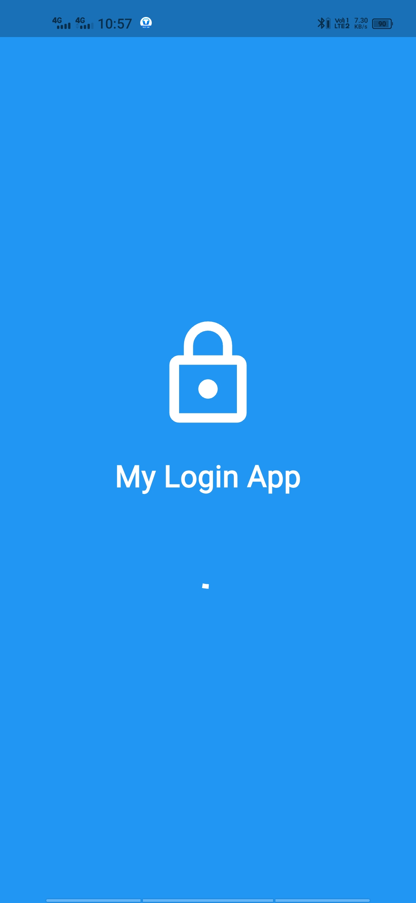
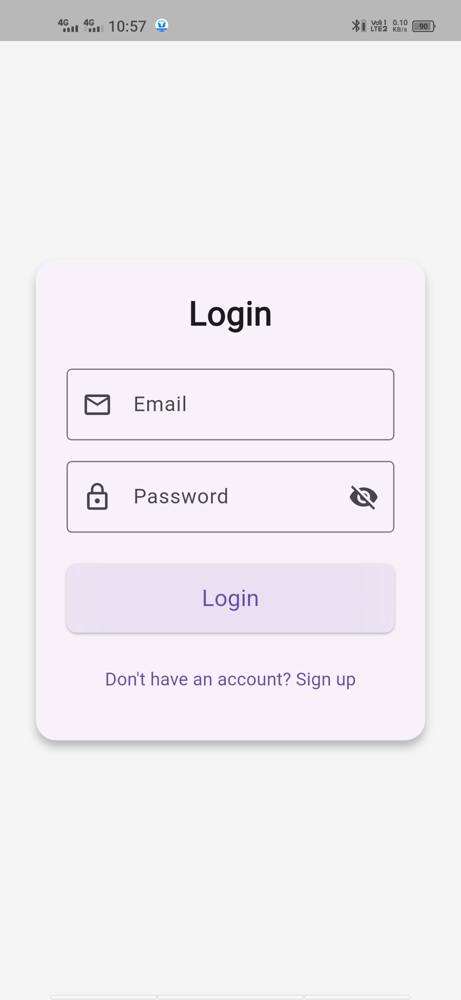

# 🚀 Flutter Login App with Splash Screen

A clean and minimal **Flutter Login Page** integrated with a **Splash Screen**.  
Built entirely using Flutter’s core widgets — no external dependencies.  

---

## 📱 Features

✅ Elegant Splash Screen with logo and progress indicator  
✅ Modern Login Page with input validation  
✅ Password visibility toggle  
✅ Email and password form validation  
✅ Clean Material Design UI  
✅ Ready to build APK directly  

---

## 🧩 Screenshots

| Splash Screen | Login Page |
|:--------------:|:-----------:|
|  |  |

> Place your screenshots (`splash.jpg` and `login.jpg`) in the **project root directory** (where `pubspec.yaml` is).

---

## ⚙️ Project Structure

